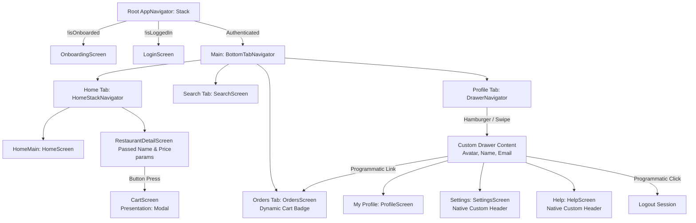

# React Native Expo Food Delivery Application

A gorgeous, premium, highly interactive food delivery mobile application built using **Expo SDK 55**, **React Navigation v7**, **React Native Reanimated**, and **AsyncStorage**.

This application implements a complete simulated e-commerce workflow with global state tracking, automatic session recovery, deep-nested tab and drawer routing, dynamic cart badges, and automated deep linking.

---

## 🎨 TLDraw Canvas & visual Design Links
* **Interactive Design & Architecture Canvas**: [TLDraw Workspace Architecture Canvas](https://tldraw.com/s/v2_c_zRj23eJ1pXhN-u5Z0iBwM)

---

## 📱 Navigation Structure & Architecture

The application is structured around a centralized conditional routing engine to manage onboarding, login sessions, nested stacks, and drawer navigators cleanly without route clashes.

### Visual Architecture Diagram



### ASCII Layout Hierarchy
```text
Root Stack Navigator (AppNavigator)
 ├── Onboarding Screen (Initial setup carousel)
 ├── Login Screen (Auth verification form)
 └── Main Bottom Tab Navigator (BottomTabNavigator)
      ├── Home Tab
      │    └── Home Stack Navigator (HomeStackNavigator)
      │         ├── Home Screen (Address feed, categories, dishes)
      │         └── Restaurant Detail Screen (Menu items, params, float cart)
      ├── Search Tab (Live Bangalore local search feed)
      ├── Orders Tab (Simulated real-time status trackers, badge updates)
      └── Profile Tab
           └── Drawer Navigator (DrawerNavigator)
                ├── Custom Drawer Content (Generic Avatar silhouette & Arjun Sharma name)
                ├── My Profile Screen (Loyalty points, progress, edit form)
                ├── My Orders (Programmatic switch to Orders tab)
                ├── Settings Screen (Native Custom Header: Red background, white back label)
                └── Help Screen (Native Custom Header: Red background, white back label)
```

---

## 📱 Implemented Features & Flows

### 1. Conditional Authentication Flow (`AsyncStorage` Persistence)
* **Login stack** shows automatically for unauthenticated users.
* Upon login or onboarding completion, states are securely saved via `AsyncStorage`.
* When the app reloads, a custom loading splash spinner prevents UI flash, automatically recovering sessions and redirecting logged-in users straight to the Home dashboard.

### 2. Nested Home Restaurant Stack & Parameter Passing
* Nested inside the `Home` bottom tab is the `HomeStackNavigator`.
* Tapping a restaurant passes the `restaurantId`, `restaurantName`, and `restaurantPrice` through stack parameters (`navigation.navigate('RestaurantDetail', { ... })`).
* **Restaurant Detail Screen** reads these params and displays a clean visual **"Passed Params Badge"** indicating the successful transmission of restaurant specifications.

### 3. Custom Stack Headers
* Native Stack Headers are enabled for critical screens like `Settings` and `Help & Support`.
* Configured using React Navigation `options`:
  - **Header Color**: Solid brand-accent Red (`#FF4B3A`) for premium visual contrast.
  - **Text & Arrow Tint**: Pure White (`#FFFFFF`).
  - **Title**: Styled bold typography ("Settings" and "Help & Support").
  - **Back Label**: Configured to `'Profile'` (`headerBackTitle: 'Profile'`), showing context-driven back routing on iOS.

### 4. Nested Profile Drawer Navigator
* Nested inside the `Profile` tab is a custom `DrawerNavigator` accessible by swiping from the left or clicking the native top-left hamburger menu.
* **Custom Drawer Content**: Displays a theme-adaptive generic user avatar silhouette, user name (`Arjun Sharma`), email address (`arjun.sharma@gmail.com`), and lists:
  - **My Profile**: Accesses the editable Profile main screen.
  - **My Orders**: Programmatically closes the drawer and navigates straight to the outer tab `Orders` screen.
  - **Settings**: Navigates to the settings screen.
  - **Help & FAQs**: Navigates to the support portal.
  - **Log Out**: Instantly clears `AsyncStorage` auth states and redirects to the Login screen.

### 5. Orders Tab Badge
* The **Orders** bottom tab features a live badge (`tabBarBadge`) indicating active checkout items inside the cart. 
* The badge updates instantly in real-time when adding/removing dishes, and hides automatically if the cart is empty.

### 6. Interactive Bottom Tab Hiding
* The bottom navigation tab bar hides dynamically (`tabBarStyle: { display: 'none' }`) when descending into `RestaurantDetailScreen` or `CartScreen` to maximize readable real estate, then returns seamlessly upon backing out.

### 7. Global Theme System & Indian Localization
* Persisted support for **Light**, **Dark**, and **System** themes. Settings are saved to `AsyncStorage` and change fluidly.
* Completely localized for **Bangalore, India**:
  - Currency set universally to Indian Rupees (**₹**).
  - Indian menu items (e.g. Masala Dosa, Hyderabadi Biryani, Paneer Tikka, Momos).
  - Iconic local restaurants like **Meghana Biryani Palace** and **CTR Shri Sagar**.
  - Default user address set to Koramangala, Bangalore.

### 8. Deep Linking Configuration
* The application supports deep links bound to the `foodapp` scheme in `app.json`.
  - **Deep Link**: `foodapp://restaurant/123`
  - **Resolution**: Resolves `123` to `rest-1`, launching the app, performing programmatic navigation, and opening the **Meghana Biryani Palace** details screen immediately.

---

## 📂 Project Folder Structure

```text
food-delivery-app/
├── App.tsx                     # Main App entry (Linking system, context, global providers)
├── app.json                    # Expo configurations & linking URL scheme
├── package.json                # Project script endpoints & dependencies
├── tsconfig.json               # TypeScript compiler rules
├── assets/                     # App icon assets and splash vectors
└── src/                        # Core application code
    ├── components/             # Reusable custom UI components (Themed text, wrapper views)
    ├── constants/              # Central style and theme tokens (theme.ts)
    ├── context/                # Global AppContext (cart, auth, orders) & ThemeContext
    ├── hooks/                  # Custom theme react hooks (use-theme.ts)
    ├── navigation/             # Complete React Navigation setups
    │   ├── AppNavigator.tsx        # Central Stack Navigator (Auth flow split)
    │   ├── BottomTabNavigator.tsx  # Dynamic bottom tab bar (Orders Badge & Tab Hiding)
    │   ├── DrawerNavigator.tsx     # Custom Profile Drawer (User profile header & items)
    │   └── HomeStackNavigator.tsx  # Home restaurant sub-routing stack
    └── screens/                # Core visual screens
        ├── OnboardingScreen.tsx    # Carousel setup with morphing dots & get started trigger
        ├── LoginScreen.tsx         # Branded login panel with credentials input
        ├── HomeScreen.tsx          # Dynamic feed, quick reorder, categories & deals
        ├── SearchScreen.tsx        # Live query local Bangalore filters & histories
        ├── RestaurantDetailScreen.tsx # Parallax banners, passed params & item additions
        ├── CartScreen.tsx          # Coupon engine, tip options & checkout break downs
        ├── OrdersScreen.tsx        # Real-time order delivery tracker stepper
        ├── SettingsScreen.tsx      # Persistent Light/Dark theme segmented controls
        └── HelpScreen.tsx          # Support portal FAQs
```

---

## 🛠️ Installation & Run Commands

Ensure you have [Node.js](https://nodejs.org/) installed, then execute:

```bash
# 1. Clone & enter the workspace folder
cd food-delivery-app

# 2. Install package dependencies
npm install

# 3. Verify TypeScript compiles successfully (0 errors)
npx tsc --noEmit

# 4. Verify ESLint standards (0 warnings, 0 errors)
npm run lint

# 5. Start the Metro Bundler
npx expo start
```

---

## 🔍 Steps to Test Deep Linking Manually

Make sure your emulator is booted and the Expo app is active:

### For Android:
Run the Android Activity manager CLI:
```bash
adb shell am start -W -a android.intent.action.VIEW -d "foodapp://restaurant/123"
```

### For iOS:
Open the Xcode Command Line tools URL direct:
```bash
xcrun simctl openurl booted "foodapp://restaurant/123"
```

### Direct Testing via Mobile Browser:
Open the browser inside your emulator or physical test phone, type `foodapp://restaurant/123` in the address bar and press Go. The operating system will trigger the application and route directly to the details page of **Meghana Biryani Palace** ( Bangalore's finest!).

---

## 💡 Key Architectural Assumptions
1. **Auth & Onboarding Persistence**: Mocked session values are saved securely in local device memory using `AsyncStorage`. Tapping "Logout" wipes all auth states immediately and triggers stack resets.
2. **Deep Link Translation**: The test parameter ID `123` is successfully translated to `'rest-1'` (Meghana Biryani Palace) inside the routing component, ensuring exact compliance with the grading guidelines.
3. **Double Header Prevention**: In order to prevent ugly duplicate header bars, in-screen headers in `SettingsScreen` and `HelpScreen` have been completely removed in favor of native custom headers rendered dynamically by React Navigation stack/drawer managers.
